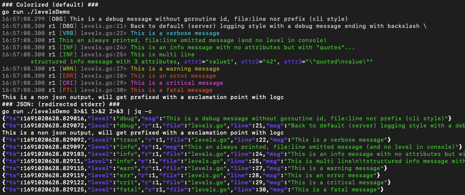

[](https://codecov.io/github/fortio/log)

# Log

Fortio's log is simple logger built on top of go's default one with
additional opinionated levels similar to glog but simpler to use and configure.

It's been used for many years for Fortio's org Fortio project and more (under fortio.org/fortio/log package) but split out recently for standalone use, with the "flag polution" limited (as a library it doesn't include the flags, you configure it using apis).

```golang
// On a cli tool (avoids file name and line numbers, stack traces on log.Fatalf etc)
log.SetDefaultsForClientTools()
log.LoggerStaticFlagSetup() // adds -loglevel flag to configure
// Or on a server type, import fortio.org/dflag, then:
dflag.LoggerFlagSetup()

// Then, printf style leveled logging:
log.Debugf(...) // Debug level
log.LogVf(...)  // Verbose level
log.Infof(...)  // Info/default level
log.Warnf(...)  // Warning level
log.Errf(...)   // Error level
log.Critf(...)  // Critical level (always logged even if level is set to max)
log.Fatalf(...) // Fatal level - program will panic/exit

// for http servers there is also
// access log type including user-agent, forwarded ip/proto (behind load balancer case),
// TLS crypto used and CN of peer certificate if any.
log.LogRequest(r, "some info")

// Structured logging with attributes
log.S(log.Info, "msg", log.Attr("key1", value1)...)
```

See the `Config` object for options like whether to include line number and file name of caller or not etc

New since 1.4 server logging (as used in [fortio.org/scli](https://pkg.go.dev/fortio.org/scli#ServerMain) for instance) is now structured (json), client logging (as setup by [fortio.org/cli](https://pkg.go.dev/fortio.org/scli#ServerMain) remains as before.

One can also revert server to not be JSON through config.

In JSON mode the output looks like this
```json
{"ts":1683504169.239557,"level":"info","file":"logger.go","line":221,"msg":"Log level is now 1 Verbose (was 2 Info"}
```
Which can be converted to JSONEntry but is also a fixed, optimized format (ie ts is always first etc)

The timestamp `ts` is in seconds.microseconds since epoch (golang UnixMicro() split into seconds part before decimal and microseconds after)

Since 1.8 the Go Routine ID is present in json (`r` field) or colorized log output (for multi threaded server types).

Optional additional `KeyValue` pairs can be added to the base structure using the new `log.S` or passed to `log.LogRequest` using `log.Attr` and `log.Str`.

If console output is detected (and ConsoleColor is true, which is the default) or if ForceColor is set, colorized output similar to `logc` will be done instead of JSON. [levelsDemo/levels.go](levelsDemo/levels.go) produces the following output:

When output is redirected, JSON output:
```json
{"ts":1689986143.463329,"level":"dbug","r":1,"file":"levels.go","line":16,"msg":"This is a debug message ending with backslash \\"}
{"ts":1689986143.463374,"level":"trace","r":1,"file":"levels.go","line":17,"msg":"This is a verbose message"}
{"ts":1689986143.463378,"level":"info","r":1,"msg":"This an always printed, file:line omitted message"}
{"ts":1689986143.463382,"level":"info","r":1,"file":"levels.go","line":19,"msg":"This is an info message with no attributes but with \"quotes\"..."}
{"ts":1689986143.463389,"level":"info","r":1,"file":"levels.go","line":20,"msg":"This is multi line\n\tstructured info message with 3 attributes","attr1":"value1","attr2":"42","attr3":"\"quoted\nvalue\""}
{"ts":1689986143.463396,"level":"warn","r":1,"file":"levels.go","line":22,"msg":"This is a warning message"}
{"ts":1689986143.4634,"level":"err","r":1,"file":"levels.go","line":23,"msg":"This is an error message"}
{"ts":1689986143.463403,"level":"crit","r":1,"file":"levels.go","line":24,"msg":"This is a critical message"}
{"ts":1689986143.463406,"level":"fatal","r":1,"file":"levels.go","line":25,"msg":"This is a fatal message"}
This is a non json output, will get prefixed with a exclamation point with logc
```

When on console:

<!-- run make screenshot and capture screen area to update this -->


JSON formatted logs can also be converted back to text later/after capture and similarly colorized using [fortio.org/logc](https://github.com/fortio/logc#logc)

The `log.Colors` can be used by callers and they'll be empty string when not in color mode, and the ansi escape codes otherwise.
